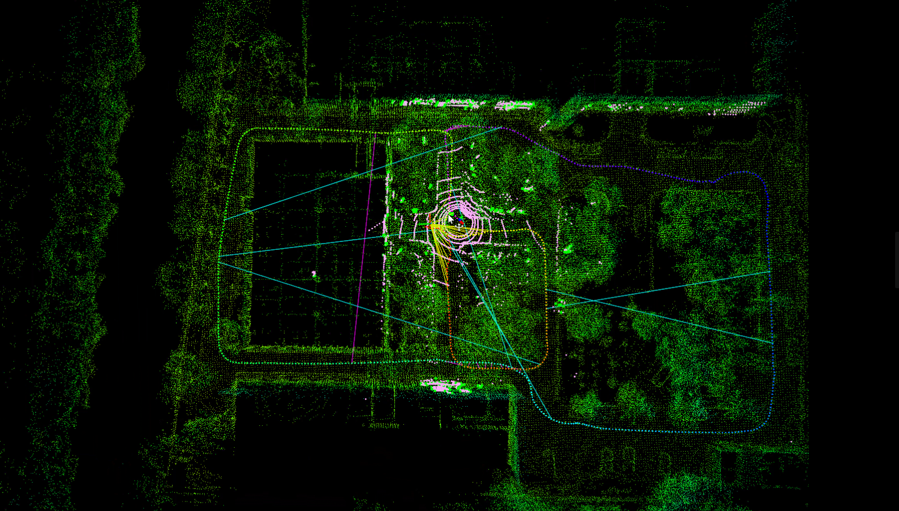

<a href="#"></img></a>
  <a href="#"></img></a>
  <a href="#"></img></a>
  <a href="#"></img></a>
  <a href="https://github.com/chengwei0427/BoW3D-LeGO-LOAM/issues"></img></a>
  <a href="https://github.com/chengwei0427/BoW3D-LeGO-LOAM/graphs/contributors"></img></a>

## BoW3D-LeGO-LOAM: BoW3D (2022RA-L) + LeGO-LOAM (18 IROS)
This repository is an example use-case of  [**BoW3D**](https://github.com/YungeCui/BoW3D), [**scan context**](https://github.com/irapkaist/scancontext) and [**lego_loam**](https://github.com/RobustFieldAutonomyLab/LeGO-LOAM);

<div align="center">

</div>


## Video 
-  [Video](https://www.bilibili.com/video/BV1KP4y197yb/?vd_source=438f630fe29bd5049b24c7f05b1bcaa3)


## Examples
- TBA


## How to use 
- Place the directory `BoW3D-LeGO-LOAM` under user catkin work space 
- For example, 
    ```
    cd ~/catkin_ws/src
    git clone https://github.com/chengwei0427/BoW3D-LeGO-LOAM.git
    cd ..
    catkin_make
    source devel/setup.bash
    roslaunch lego_loam run.launch
    ```


## Dependencies
- All dependencies are same as LeGO-LOAM (i.e., ROS, PCL, and GTSAM).
- We used C++14 to use std::make_unique in Scancontext.cpp but you can use C++11 with slightly modifying only that part.


## Misc notes
- TBA

